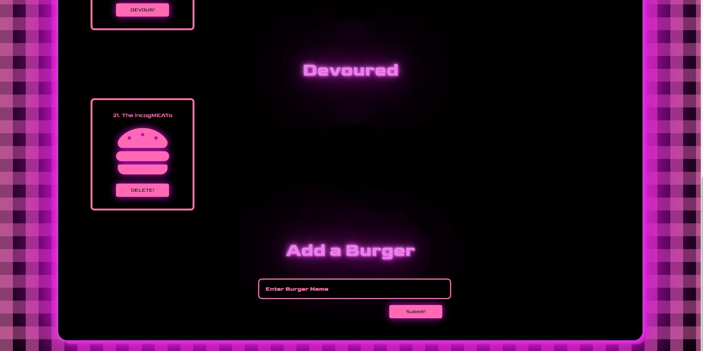
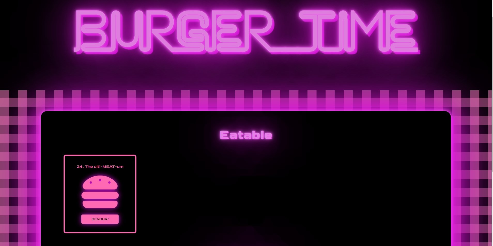

# Burger_Logger

## **Table of Contents** 

  - [Description](#description)
  - [Elements](#elements)
  - [Installation Instructions](#installation)
  - [Usage](#usage)
  - [Contributors](#contributors)
  - [Aids](#aids)
  - [Links](#links)

## **Description**
For this project we were asked to create a burger logger app that would create burgers, move burgers from eatable to devoured and delete burgers

## **Elements**

This app needed to connect to a database, log new burgers, update burgers, and delete burgers.

The connection is set up here for local use. Below in the commented out section is the JAWSDB connection.

Config 

Database

Models

## **Installation Instructions**
Dependencies Required
express
express-handlebars
mysql

## **Usage**

In the eatable category we have eatable burgers that have been added from the database.

The devoured burgers can be moved from eatable to devoured onclick. 
The add burger form at the bottom allows you to add a new burger to the page

If we add a burger

It will appear in the eatable category.

You can add more than one new burger.

You can move some to the devoured category.
  
And delete the newly devoured burgers.

## **Contributors**
This project was done by:

Leah O'Gorman -- https://github.com/leahogorman

## **Aids**
research was done by searching w3schools and stackoverflow

https://www.w3schools.com/

https://stackoverflow.com/

The Neon Effect was done with aid from

https://codepen.io/Trinca/pen/NAvpWa
https://codepen.io/GeorgePark/pen/MrjbEr

Additionally the project was done with aid from our instructors

Fil -- https://github.com/c0dehot

Daniel Ceballos -- https://github.com/shibeknight

## **Links**

The Heroku live link is: https://polar-island-87219.herokuapp.com/

The Github link is: https://github.com/leahogorman/Employee-Directory
                    https://leahogorman.github.io/Employee-Directory/

